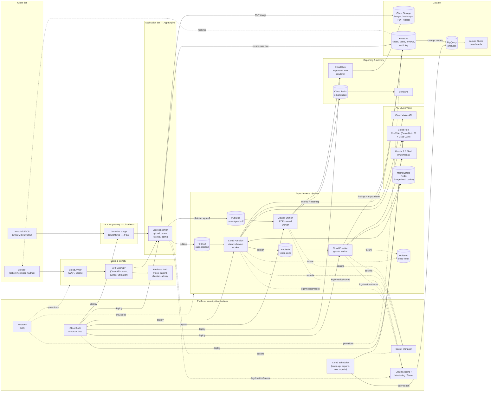
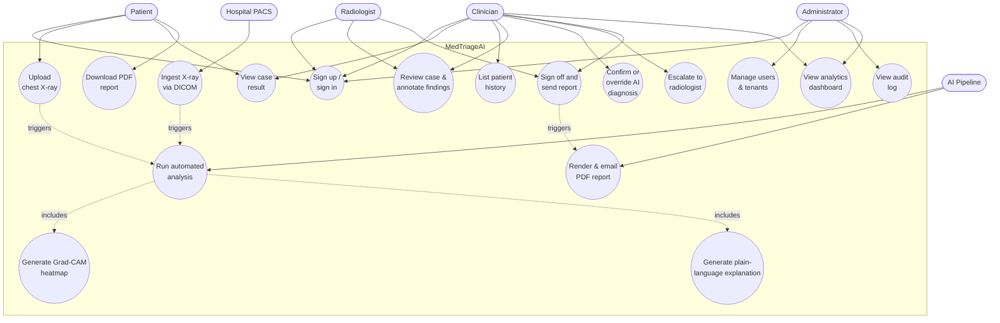
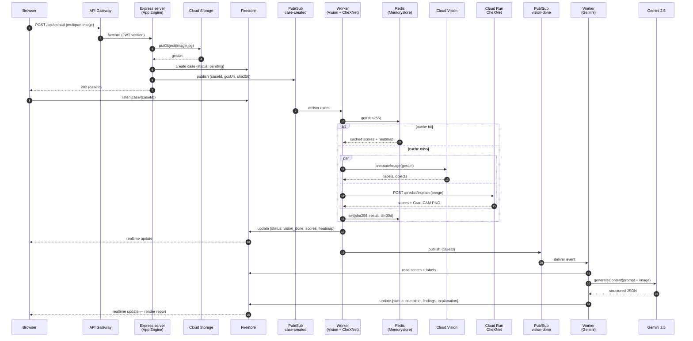
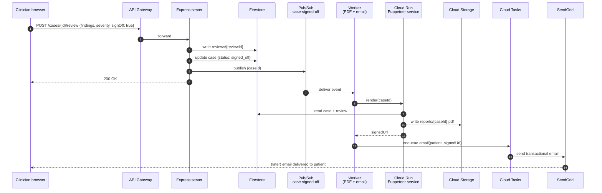
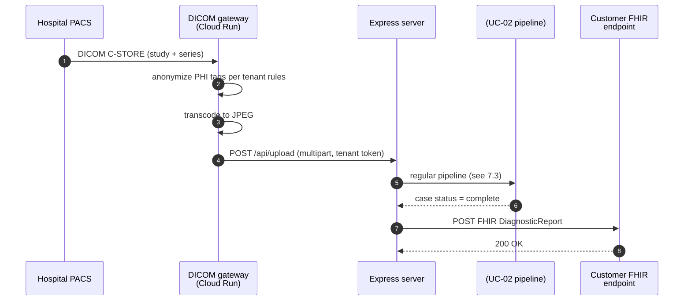

# MedTriageAI — Technical Report (Homework 5 / Final Project Documentation)

**Course:** Cloud Computing — Year III, Semester II
**Project:** MedTriageAI — Cloud-based AI-assisted Chest X-Ray Triage Platform
**Date:** May 2026

> **Scope of this document.** This is the technical documentation for the **final delivered product**. It describes the complete proposed system — all services, APIs, and workflows we intend to ship. Section 11 (*Implementation Status & Roadmap*) tracks which capabilities are already implemented in the MVP and which are in active development for the final delivery.

---

## 1. Case Study — Project in the National and International Reality

### 1.1 The problem we are solving

Chest X-ray (CXR) is the most frequently performed medical imaging exam worldwide — over **2 billion CXRs acquired every year** — yet the supply of qualified radiologists is structurally insufficient to interpret them in a timely manner. The bottleneck is most acute in emergency departments, rural clinics, and during off-hours shifts, where a CXR may wait hours or even days for a formal read.

**MedTriageAI** is a multi-tenant cloud-native SaaS platform that takes a chest X-ray image and returns, in under a minute, (a) probability scores for 14 thoracic pathologies, (b) a Grad-CAM heatmap localizing the most suspicious region, and (c) a structured plain-language explanation generated by a multimodal LLM. A clinician then reviews, edits, signs off, and the system delivers a PDF report to the patient.

It is explicitly **not** a diagnostic device — it is a triage and prioritization aid for non-radiologist clinicians.

### 1.2 International reality

- **Radiologist shortage.** A 2023 *Lancet Digital Health* commentary estimated that **two-thirds of the world's population lacks access to basic medical imaging interpretation.** In sub-Saharan Africa there is approximately **one radiologist per million inhabitants**. Even in the United Kingdom, the Royal College of Radiologists reports a 30 % shortfall in radiology workforce.
- **AI imaging market.** The AI-in-medical-imaging market was valued at roughly **USD 1.1 B in 2023** and is projected to exceed **USD 8 B by 2030** (CAGR ~30 %). The U.S. FDA had cleared **over 700 AI/ML-enabled medical devices** by mid-2024, the majority in radiology.
- **Pandemic accelerator.** COVID-19 demonstrated the value of automated CXR triage; the WHO and Stop TB Partnership now endorse **AI-based CXR screening** as a frontline tool for tuberculosis case-finding in high-burden countries.

### 1.3 National reality (Romania)

- Romania has approximately **6.0 radiologists per 100 000 inhabitants**, **below the EU average (~12.7)**. Public hospitals routinely report 1–3 day delays for non-emergency CXR reads.
- Romania has one of the **highest tuberculosis incidence rates in the EU** (~46 / 100 000), making fast CXR triage particularly valuable in primary care and TB screening programs.
- The national health platform **PIAS / DES** (Dosarul Electronic de Sănătate, run by CNAS) is gradually rolling out electronic patient records, providing a future integration path.
- The Ministry of Health's **PNRR digitalization investment line** (Component 12 — Health) allocates over **EUR 470 M** for hospital IT modernization between 2022 and 2026, creating a procurement window for cloud-based AI tools.

### 1.4 Where MedTriageAI fits

MedTriageAI targets the gap between *image acquisition* and *radiologist read*:

- **County emergency hospitals (SJU)** that lack 24/7 radiology coverage.
- **Family-medicine clinics** in rural counties using portable X-ray units.
- **NGO and screening programs** (TB, occupational lung disease) where throughput matters more than full diagnostic reads.
- **Telemedicine providers** needing an automated first-pass triage to route urgent cases.

Unlike the established enterprise players, MedTriageAI is designed from day one as a **multi-tenant SaaS on a public cloud (GCP)**, with a low per-case marginal cost, removing the up-front capital expense that has kept Romanian public hospitals out of the AI-radiology market until now.

---

## 2. Existing Solutions — Competitive and Technical Landscape

We benchmarked five solutions that overlap with MedTriageAI's scope.

| Solution | Origin | Modality scope | Architecture | Regulatory | Go-to-market |
|---|---|---|---|---|---|
| **Aidoc** | Israel | Multi-modality (CT, CXR) | On-prem appliance + cloud backbone (AWS); DICOM router intercepts PACS traffic | FDA-cleared (15+ algorithms), CE | Direct enterprise sales to hospital systems; "always-on" subscription |
| **Lunit INSIGHT CXR** | South Korea | Chest X-ray only | Hybrid: cloud inference + on-prem PACS plug-in | FDA-cleared, CE, KFDA | Partnerships with imaging vendors (GE Healthcare, Philips) |
| **Qure.ai (qXR / qER)** | India | CXR + Head CT | Cloud-native (AWS); REST + DICOMweb APIs; offline mode for low-connectivity regions | CE, US FDA (qER), WHO endorsement for TB | WHO/Stop TB pricing tiers; NGO partnerships; per-scan pricing |
| **Annalise.ai** | Australia / UK | CXR + Brain CT | Cloud-native (Azure), workflow-integrated viewer | CE, TGA, FDA pending | Hospital enterprise contracts; viewer plug-in for Sectra/Agfa |
| **Google Health (CXR research)** | USA | CXR research | TPU-trained transformer models (CXR Foundation, ELIXR); not commercialized as standalone product | None (research) | API access via Google Cloud Healthcare; OEM licensing |

### 2.1 Architectural patterns observed

1. **DICOM-first ingestion.** All commercial competitors integrate with hospital PACS via DICOM C-STORE or DICOMweb, not file uploads. *Implication for MedTriageAI:* a DICOM gateway is in scope for the final product — described in §3.5.
2. **Hybrid edge + cloud.** Aidoc and Lunit deploy an on-prem appliance for latency, privacy, and offline operation; only metadata reaches the cloud. *Implication:* our CheXNet service is packaged as a container so the **same artifact can be deployed on Cloud Run (SaaS) or an on-prem Kubernetes / k3s node** (enterprise).
3. **Workflow integration over standalone UI.** Radiologists do not switch tools — Aidoc and Annalise embed results in the existing PACS viewer. *Implication:* MedTriageAI's web UI is sufficient for non-radiology buyers (ED, family medicine); for enterprise we expose a **FHIR/HL7 webhook** so results land in the customer's existing viewer.
4. **Multi-model ensembles.** Modern systems combine specialized CNNs with downstream LLMs for narrative report generation — exactly the **CheXNet + Gemini** pattern we adopted.

### 2.2 Marketing approaches observed

- **Clinical evidence first.** Every competitor lists peer-reviewed publications and regulatory clearances prominently. Marketing is B2B, evidence-driven.
- **Outcome-based pricing.** Per-scan or per-bed pricing is becoming the norm; CapEx licenses are declining.
- **Reference customers and KOLs.** Public case studies with brand-name hospitals (Mayo Clinic, NHS trusts, AIIMS) are the primary trust signal.
- **Conference visibility.** RSNA (Chicago) and ECR (Vienna) are the two conferences where this market is made.

### 2.3 Where MedTriageAI differentiates

| Dimension | Competitors | MedTriageAI |
|---|---|---|
| Deployment | On-prem appliance + enterprise contract | Pure cloud SaaS, self-service sign-up |
| Pricing entry point | Annual enterprise license (≥ 5-figure EUR) | Pay-per-case (target < 1 EUR / case) |
| Target buyer | Hospital CIO / Head of Radiology | Family-medicine clinic, county ED, NGO program |
| LLM-generated explanation | Limited / experimental | Native, built into the pipeline (Gemini 2.5) |
| Regulatory | Class IIa medical device | Decision-support / non-diagnostic (intentionally narrower scope) |

---

## 3. Technologies — Overview and Motivation

The system is organized into six layers: **client**, **edge & identity**, **application**, **asynchronous pipeline**, **AI/ML services**, and **data, platform & operations**. Every technology below is part of the final product.

### 3.1 Client tier

| Technology | Role | Why |
|---|---|---|
| **HTML / CSS / JavaScript (vanilla)** | Patient & clinician UI | The UI surface is small (upload, result view, history, sign-off); avoiding a SPA framework cuts complexity, bundle size, and build cost; served as static files by App Engine |
| **Firestore Web SDK (realtime listeners)** | Push-based UI updates | Eliminates polling: the result page subscribes to the case document and re-renders as the pipeline transitions `pending → vision_done → complete` |
| **Chart.js** | Score-bar visualization for CheXNet probabilities | Tiny dependency, no framework cost, accessible |

### 3.2 Edge & identity tier

| Technology | Role | Why |
|---|---|---|
| **Google Cloud API Gateway** | TLS termination, OpenAPI-driven routing, per-key quotas, request validation | The same OpenAPI document on **SwaggerHub** is the source of truth for client SDKs *and* the gateway config; protects backends from runaway tenants |
| **Firebase Authentication** | Identity for three actor classes (patient, clinician, admin) | Out-of-the-box Google / email sign-in, JWT issuance, **custom claims** for tenant + role; integrates natively with Firestore security rules; free tier covers our scale |
| **Cloud Armor** | WAF / DDoS protection in front of the gateway | Compliance baseline for any internet-facing healthcare API |

### 3.3 Application tier

| Technology | Role | Why |
|---|---|---|
| **Node.js 20 + Express 5** | API and orchestration server | Mature ecosystem for GCP SDKs; async I/O fits a pipeline that fans out to multiple long-running services; team familiarity |
| **Google App Engine (Standard, F1)** | Hosting for the Express app | Fully managed, zero-ops, auto-scales to zero; F1 fits free tier; native integration with Cloud Storage, Firestore, IAM |
| **Multer** | Multipart upload handling | Mature, well-known; memory-storage variant streams directly to Cloud Storage without temp files |
| **Joi / Zod** | Request-body schema validation | Defense-in-depth on top of the API Gateway request validation |

### 3.4 Asynchronous pipeline tier

The pipeline is event-driven so a slow or failing AI service does not block uploads, and individual stages scale independently.

| Technology | Role | Why |
|---|---|---|
| **Cloud Pub/Sub** | Decoupled stage-to-stage messaging | At-least-once delivery, exponential back-off, **dead-letter topics**; we use three topics: `case-created`, `vision-done`, `case-signed-off` |
| **Cloud Functions (2nd gen)** | Per-stage workers (Vision+CheXNet worker, Gemini worker, PDF worker, email worker) | Auto-scales per topic, billed per invocation, deploys independently of the Express server |
| **Cloud Tasks** | Outbound webhook delivery & email enqueueing | First-class retry semantics for fan-out to external systems (patient email, partner FHIR endpoints) |

### 3.5 AI / ML services tier

| Technology | Role | Why |
|---|---|---|
| **CheXNet (DenseNet-121)** containerized on **Cloud Run** | 14-class thoracic pathology classifier with Grad-CAM heatmap | Peer-reviewed model (Rajpurkar et al., 2017) trained on ChestX-ray14 (112 120 images); deterministic numerical output we rely on as the **primary signal**; Cloud Run scales to zero, keeping idle cost near zero |
| **Google Cloud Vision API** | Generic image labels + object localization | Sanity check ("is this actually an X-ray?") and supplementary context for the LLM; managed service, no model maintenance |
| **Google Gemini 2.5 Flash** (multimodal) | Generates structured findings, plain-language explanation, severity, classification | Strong multimodal reasoning at low cost-per-token; Flash variant has sub-second latency; JSON-mode output integrates cleanly with Firestore |
| **Memorystore (Redis)** | Inference cache keyed by SHA-256 of the image bytes | Same X-ray uploaded twice does not re-spend on Gemini/CheXNet; sub-millisecond hit latency |
| **DICOM gateway** (Cloud Run service, `dcm4che` toolkit) | Accepts DICOM C-STORE / DICOMweb from hospital PACS, normalizes to JPEG, hands off to the regular upload pipeline | Required for enterprise sales; isolates DICOM complexity from the main API |

**Design philosophy** — "**specialized model first, generalist model second**": CheXNet provides the calibrated numerical signal; Gemini provides the narrative and reconciles signals into a clinician-readable report. This avoids the well-known weakness of relying on a generalist LLM as the only diagnostic engine.

### 3.6 Reporting & delivery tier

| Technology | Role | Why |
|---|---|---|
| **Cloud Run service (Puppeteer + Handlebars)** | Renders signed PDF report from case + review data | Headless Chrome produces print-grade PDFs from the same HTML template used in the UI |
| **SendGrid** (via Cloud Tasks) | Transactional email to patients with signed-URL link to PDF | Reliable deliverability, EU data-residency option, free tier for early scale |
| **Cloud Storage signed URLs** | Time-limited download links for the PDF | No need to proxy file traffic through App Engine; URLs expire after 7 days |

### 3.7 Data tier

| Technology | Role | Why |
|---|---|---|
| **Cloud Storage** (`medtriage-images` bucket) | Raw image, heatmap PNG, generated PDF report | Cheapest durable storage on GCP; **lifecycle rules** auto-delete raw images after the configured retention period (default 30 days) |
| **Firestore (Native mode)** | Case documents, user profiles, reviews subcollection, audit log | Document model fits the heterogeneous case schema; realtime listeners feed the UI; **security rules** enforce tenant + role isolation |
| **BigQuery** | De-identified analytics warehouse | Daily export of case metadata for dashboards (case volume, severity distribution, model agreement, per-pathology recall); SQL interface for clinical-research partners |
| **Looker Studio** | Dashboards on top of BigQuery | Zero-cost, native to GCP, sufficient for internal product and clinical reporting |

### 3.8 Platform, security & operations tier

| Technology | Role | Why |
|---|---|---|
| **Secret Manager** | Centralized storage for Gemini API key, SendGrid key, partner credentials | Removes secrets from `app.yaml` / env vars; rotated without redeploy; IAM-controlled access |
| **Cloud Logging + Cloud Monitoring** | Structured logs, SLO dashboards, alerting policies | First-party, zero-config from App Engine, Cloud Run, and Cloud Functions; alerts on pipeline error rate, P95 latency, dead-letter backlog |
| **Cloud Trace** | Distributed tracing across Express → Pub/Sub → workers | Enables root-cause analysis on slow cases |
| **Cloud Scheduler** | Cron jobs: nightly BigQuery export, hourly CheXNet warm-up ping, weekly cost report | Replaces external schedulers, integrates with IAM |
| **Cloud Build** | CI/CD pipeline (test → SonarCloud scan → deploy to App Engine, Cloud Run, Functions) | Native to GCP, triggered from GitHub |
| **SonarCloud** | Static analysis & quality-gate enforcement on every PR | Implements the maintainability-metrics literature cited in the brief; build fails on quality-gate violation |
| **Terraform** | Infrastructure-as-Code for all GCP resources | Reproducible environments (dev / staging / prod), reviewable infrastructure changes |
| **SwaggerHub** | API design and documentation hub | Single source of truth for the OpenAPI 3.0 spec; generates client SDKs and gateway configs |

### 3.9 Why GCP (vs. AWS / Azure)

- **First-party multimodal LLM** (Gemini) without leaving the cloud trust boundary — important for healthcare data residency.
- **Cloud Run + App Engine Standard + Cloud Functions** all scale to zero, ideal for an early-stage product with bursty traffic.
- **Vertex AI** provides a managed path for our own future fine-tuned models without re-platforming.
- **EU regions (`europe-west`)** satisfy GDPR data-residency commitments to Romanian customers.

---

## 4. Business Model Canvas

```
┌──────────────────────┬──────────────────────┬──────────────────────┬──────────────────────┬──────────────────────┐
│ KEY PARTNERS         │ KEY ACTIVITIES       │ VALUE PROPOSITIONS   │ CUSTOMER RELATIONSHIPS│ CUSTOMER SEGMENTS    │
├──────────────────────┼──────────────────────┼──────────────────────┼──────────────────────┼──────────────────────┤
│ • Google Cloud       │ • Pipeline R&D       │ For non-radiologist  │ • Self-serve web     │ Primary:             │
│   (infrastructure)   │   (CheXNet+Gemini)   │ clinicians:          │   sign-up            │ • County emergency   │
│ • Romanian county    │ • Clinical validation│ "From X-ray to a     │ • Per-customer       │   hospitals (SJU)    │
│   hospitals (pilots) │   studies            │ structured, ranked,  │   onboarding for     │   without 24/7       │
│ • Universitatea de   │ • Regulatory work    │ explained finding in │   hospitals          │   radiology cover    │
│   Medicină (clinical │   (CE non-diagnostic │ under 60 s, at less  │ • Clinical liaison   │ • Family-medicine    │
│   advisors)          │   pathway)           │ than 1 EUR / case."  │   for KOL accounts   │   clinics, rural CCT │
│ • PACS vendors       │ • DICOM / FHIR       │                      │ • Email + ticket     │                      │
│   (DICOM bridges)    │   integrations       │ For health systems:  │   support            │ Secondary:           │
│ • CNAS / Min. of     │ • Customer support   │ "Zero CapEx, GDPR-   │ • Community of       │ • TB / occupational  │
│   Health (procurement│ • Sales (B2B / B2B2C)│ resident SaaS for AI │   practice (forum)   │   screening programs │
│   under PNRR C12)    │                      │ triage that lifts    │                      │ • Telemedicine       │
│ • Stop TB / WHO      │                      │ throughput without   │                      │   providers          │
│   (TB screening)     │                      │ a new appliance."    │                      │ • NGOs in low-       │
│ • SendGrid (email)   │                      │                      │                      │   resource regions   │
│ • SonarCloud / GitHub│                      │ For NGOs:            │                      │                      │
│   (CI / code quality)│                      │ "AI CXR triage with  │                      │                      │
│                      │                      │ heatmaps deployable  │                      │                      │
│                      │                      │ from any browser, no │                      │                      │
│                      │                      │ install, no PACS."   │                      │                      │
├──────────────────────┼──────────────────────┤                      ├──────────────────────┼──────────────────────┤
│                      │ KEY RESOURCES        │                      │ CHANNELS             │                      │
│                      ├──────────────────────┤                      ├──────────────────────┤                      │
│                      │ • CheXNet weights    │                      │ • Direct web         │                      │
│                      │   + Grad-CAM         │                      │   (medtriage.ai)     │                      │
│                      │ • Curated CXR eval   │                      │ • RSNA / ECR booth   │                      │
│                      │   set                │                      │ • PACS-vendor        │                      │
│                      │ • GCP credits        │                      │   marketplace        │                      │
│                      │ • Engineering team   │                      │ • Public procurement │                      │
│                      │ • Clinical advisors  │                      │   (PNRR C12)         │                      │
│                      │ • CE non-diagnostic  │                      │ • Clinical publish.  │                      │
│                      │   self-assessment    │                      │ • NGO partnerships   │                      │
├──────────────────────┴──────────────────────┴──────────────────────┴──────────────────────┴──────────────────────┤
│ COST STRUCTURE                                                  │ REVENUE STREAMS                                 │
├─────────────────────────────────────────────────────────────────┼─────────────────────────────────────────────────┤
│ • Cloud variable: Gemini tokens (~0.10 EUR/case),               │ • Pay-per-case:  0.80 EUR / case (SMB tier)     │
│   Cloud Run CheXNet inference (~0.03 EUR/case),                 │ • Subscription:  flat 499 EUR / month            │
│   Cloud Vision (~0.01 EUR/case), Storage + egress (~0.01)       │   (up to 1000 cases, then overage)              │
│ • Fixed: salaries, clinical advisors, regulatory consultant     │ • Enterprise:    annual contract, volume-based, │
│ • One-off: CE technical file, security audit, pilot sites       │   includes SLA, DICOM gateway, on-prem option   │
│ • Marketing: conference booths, content marketing, sponsorships │ • Research / academic: discounted, with data-   │
│                                                                 │   use agreement                                  │
└─────────────────────────────────────────────────────────────────┴─────────────────────────────────────────────────┘
```

### 4.1 Value Proposition Canvas (compact)

**Customer Jobs**
- Functional: rapidly triage incoming X-rays; prioritize urgent cases; document findings for the patient file.
- Emotional: confidence when no radiologist is on-shift; reduced anxiety about missed findings.
- Social: be the modernizing clinic; meet PNRR digitalization KPIs.

**Pains**
- 4–24 h delay until a formal radiology read.
- Missing subtle findings (pneumothorax, small effusions) under fatigue.
- Cannot justify the capital cost of an Aidoc-class appliance.

**Gains**
- Same-shift triage decisions.
- Heatmap as a teaching tool for residents.
- Predictable per-case OpEx, billable into the case episode.

**Pain Relievers**
- CheXNet probability scores + Grad-CAM heatmap localize the abnormality.
- LLM explanation drafts a finding line the clinician can edit instead of write from scratch.

**Gain Creators**
- Sub-60-second median end-to-end latency.
- Multi-tenant SaaS — no IT installation.
- GDPR-resident in `europe-west`.

### 4.2 "Things you forget when setting up on Cloud" — addressed

- **Egress costs** between regions → all services pinned to `europe-west6`.
- **Cold-start latency** of Cloud Run CheXNet → minimum-instance count of 1 in production; warm-up via Cloud Scheduler ping.
- **Secret rotation** → Secret Manager + scheduled rotation, *not* environment variables in `app.yaml`.
- **Data lifecycle** → Cloud Storage lifecycle rule deletes raw images after 30 days unless retained for an active clinical case.
- **Quotas** → API Gateway quotas per customer prevent a single tenant from exhausting Gemini RPM.
- **Audit trail** → every read/write to a case document is logged into a `case-audit` Pub/Sub topic and exported to BigQuery.
- **Disaster recovery** → Firestore daily exports to a separate bucket; documented RTO 4 h / RPO 24 h.

---

## 5. Architectural Diagram

The diagram below shows the **final-product architecture** — every component described in §3 is included.



### 5.1 Component responsibilities

| Component | Responsibility |
|---|---|
| **Cloud Armor** | DDoS mitigation, IP-allow/deny lists, OWASP rule set |
| **API Gateway** | TLS termination, OpenAPI-based request validation, per-API-key quotas |
| **Firebase Auth** | End-user identity; issues JWTs with `role` and `tenantId` custom claims |
| **DICOM gateway** | Accepts DICOM C-STORE from hospital PACS; transcodes to JPEG; injects into the regular upload pipeline |
| **Express server** | HTTP API surface, upload validation, publishes pipeline events, handles clinician sign-off |
| **Pub/Sub topics** | Decouple pipeline stages; retry + dead-letter |
| **Vision + CheXNet worker** | Runs Cloud Vision and CheXNet in parallel; consults Redis cache first; writes intermediate results to Firestore |
| **Gemini worker** | Builds the LLM prompt from CheXNet scores + Vision labels; writes final findings |
| **PDF + email worker** | On clinician sign-off, calls the Puppeteer service to render the PDF, then enqueues the patient email |
| **Memorystore (Redis)** | Caches AI responses keyed by image SHA-256 to avoid recomputation |
| **Firestore** | Source of truth for case state; realtime channel back to the browser |
| **Cloud Storage** | Original image + Grad-CAM heatmap (PNG) + generated PDF; served via signed URL |
| **BigQuery + Looker Studio** | De-identified analytics for product, finance, and clinical reporting |
| **Secret Manager** | Gemini API key, SendGrid key, partner credentials |
| **Cloud Build + SonarCloud** | CI pipeline runs unit tests + quality gate, then deploys to App Engine, Cloud Run, and Cloud Functions |
| **Terraform** | Provisions every GCP resource above; one command brings up an environment |

---

## 6. Use-Case Diagrams

### 6.1 Actors

- **Patient** — uploads their own X-ray (e.g., GP-referred), views the AI-assisted result, downloads the PDF report.
- **Clinician (Family doctor / ED physician)** — reviews AI output, confirms or overrides findings, signs off the report, sends it to the patient.
- **Radiologist (optional reviewer)** — provides authoritative read on cases the clinician escalates.
- **Administrator** — manages user accounts, customer tenants, audit trail, billing.
- **AI Pipeline** — secondary actor representing the asynchronous worker chain.
- **Hospital PACS** — secondary actor representing DICOM-based image ingestion.

### 6.2 System-level use-case diagram



### 6.3 Use-case detail — "Upload chest X-ray and obtain AI-assisted report"

| Field | Content |
|---|---|
| **ID / Name** | UC-02 / Upload chest X-ray |
| **Primary actor** | Patient (or Clinician on behalf of patient) |
| **Secondary actor** | AI Pipeline |
| **Preconditions** | Actor is authenticated; image is a JPEG or PNG ≤ 10 MB; consent for processing has been recorded |
| **Postconditions (success)** | A `case` document exists in Firestore with `status = complete`, findings, severity, heatmap reference |
| **Postconditions (failure)** | A `case` document exists with `status = error` and an error message; image is retained for diagnostics |
| **Main flow** | 1. Actor selects file in browser. 2. Browser POSTs `/api/upload` multipart. 3. Server validates MIME and size. 4. Server writes image to Cloud Storage, creates case doc, publishes `case-created`. 5. Server returns `caseId`. 6. Browser subscribes to Firestore document. 7. Worker checks Redis cache by image hash; on miss, runs Vision + CheXNet in parallel; on hit, replays cached scores. 8. Worker updates case doc, publishes `vision-done`. 9. Gemini worker writes final findings. 10. Browser observes `status = complete` and renders result. |
| **Alternate flow A** | Step 7 — CheXNet cold start (HTTP 503). Worker retries up to 3 times with 10 s back-off. |
| **Alternate flow B** | Step 9 — Gemini returns malformed JSON. Worker stores raw text in `explanation`, marks classification = "Other". |
| **Exception** | Any step — exception is captured, message published to dead-letter topic, case marked `error`. |

### 6.4 Use-case detail — "Clinician review and sign-off"

| Field | Content |
|---|---|
| **ID / Name** | UC-09 / Clinician review and sign-off |
| **Primary actor** | Clinician |
| **Preconditions** | Case exists with `status = complete`; clinician role has access to tenant |
| **Main flow** | 1. Clinician opens case. 2. UI shows image, heatmap, CheXNet scores, Gemini explanation. 3. Clinician edits findings text and/or adjusts severity. 4. Clinician clicks "Sign off". 5. System creates `reviews/{reviewId}` subdoc with clinician identity, timestamp, hash of finalized content. 6. System publishes `case-signed-off`. 7. PDF worker renders the report via Puppeteer, stores in Cloud Storage, generates signed URL. 8. Email worker enqueues a SendGrid send to the patient. |
| **Alternate flow** | Step 3 — clinician disagrees with AI; selects "Escalate to radiologist". Case status moves to `awaiting_radiologist`. |

### 6.5 Use-case detail — "Ingest X-ray via DICOM"

| Field | Content |
|---|---|
| **ID / Name** | UC-02D / DICOM ingestion |
| **Primary actor** | Hospital PACS |
| **Preconditions** | Customer has configured a DICOM AE title for MedTriageAI; mTLS is established |
| **Main flow** | 1. PACS issues DICOM C-STORE to the DICOM gateway. 2. Gateway extracts the pixel data, anonymizes PHI tags per the tenant's config, transcodes to JPEG. 3. Gateway calls the internal `/api/upload` endpoint on behalf of the configured tenant. 4. Regular pipeline (UC-02 main flow) runs. 5. Result is posted back to the customer via a configured FHIR `DiagnosticReport` webhook. |

---

## 7. APIs & Functionality Flows

The API contract is defined in **OpenAPI 3.0** and hosted on **SwaggerHub**:

> `https://app.swaggerhub.com/apis/MedTriageAI/medtriage-api/1.0.0`
> *(URL is the planned publishing location; full YAML is included in the repository at `docs/openapi.yaml`.)*

### 7.1 API overview

| Endpoint | Method | Auth | Purpose |
|---|---|---|---|
| `/api/auth/session` | `POST` | Firebase ID token | Exchange Firebase token for backend session JWT |
| `/api/upload` | `POST` *(multipart/form-data)* | session JWT | Upload a chest X-ray; returns `caseId` |
| `/api/dicom` | `POST` *(DICOMweb STOW-RS)* | mTLS client cert | DICOM ingestion endpoint for hospital PACS |
| `/api/cases` | `GET` | session JWT | List cases for the authenticated user / tenant (paginated) |
| `/api/cases/{caseId}` | `GET` | session JWT | Get the full case document |
| `/api/cases/{caseId}/review` | `POST` | clinician role | Submit clinician review (edited findings, severity, sign-off) |
| `/api/cases/{caseId}/escalate` | `POST` | clinician role | Escalate case to radiologist queue |
| `/api/cases/{caseId}/report.pdf` | `GET` | session JWT | Download signed PDF report |
| `/api/admin/users` | `GET` / `POST` / `DELETE` | admin role | Manage user accounts and roles |
| `/api/admin/audit` | `GET` | admin role | Query the audit log |
| `/api/admin/metrics` | `GET` | admin role | Tenant-level analytics summary (volume, severity mix) |
| `/api/webhooks/fhir` | `POST` | API key | Outbound FHIR DiagnosticReport delivery to a customer endpoint (called by us, not by the customer — documented for completeness) |
| `/api/health` | `GET` | public | Liveness probe used by App Engine and external monitors |
| `/api/metrics` | `GET` | internal | Prometheus-format metrics for Cloud Monitoring scraping |

### 7.2 OpenAPI specification (excerpt — full file in `docs/openapi.yaml`)

```yaml
openapi: 3.0.3
info:
  title: MedTriageAI API
  version: 1.0.0
  description: |
    Cloud-based AI-assisted chest X-ray triage API.
    Non-diagnostic, decision-support only.
  contact:
    name: MedTriageAI Team
    email: contact@medtriage.ai
  license:
    name: Proprietary
servers:
  - url: https://api.medtriage.ai/v1
    description: Production
  - url: https://medtriage.ew.r.appspot.com/api
    description: MVP (App Engine direct)

components:
  securitySchemes:
    bearerAuth:
      type: http
      scheme: bearer
      bearerFormat: JWT
    apiKeyAuth:
      type: apiKey
      in: header
      name: X-API-Key
  schemas:
    Case:
      type: object
      required: [caseId, status, timestamp]
      properties:
        caseId:    { type: string, format: uuid }
        tenantId:  { type: string }
        status:
          type: string
          enum: [pending, vision_processing, vision_done, analyzing, complete, awaiting_radiologist, signed_off, error]
        timestamp:    { type: string, format: date-time }
        imageUrl:     { type: string, format: uri }
        heatmap:      { type: string, description: base64-encoded PNG }
        visionLabels:
          type: array
          items: { $ref: '#/components/schemas/VisionLabel' }
        chexnetScores:
          type: object
          additionalProperties: { type: number, minimum: 0, maximum: 1 }
        chexnetTopFindings:
          type: array
          items: { $ref: '#/components/schemas/Finding' }
        classification: { type: string }
        severity:
          type: string
          enum: [normal, mild, moderate, severe, unknown]
        findings:    { type: string }
        explanation: { type: string }
        error:       { type: string, nullable: true }
    VisionLabel:
      type: object
      properties:
        description: { type: string }
        score:       { type: number, minimum: 0, maximum: 1 }
    Finding:
      type: object
      properties:
        name:  { type: string }
        score: { type: number, minimum: 0, maximum: 1 }
    Review:
      type: object
      required: [findings, severity]
      properties:
        findings: { type: string }
        severity:
          type: string
          enum: [normal, mild, moderate, severe]
        signOff:  { type: boolean }

security:
  - bearerAuth: []

paths:
  /upload:
    post:
      summary: Upload a chest X-ray
      requestBody:
        required: true
        content:
          multipart/form-data:
            schema:
              type: object
              properties:
                image: { type: string, format: binary }
              required: [image]
      responses:
        '202':
          description: Accepted, processing started
          content:
            application/json:
              schema:
                type: object
                properties:
                  caseId: { type: string, format: uuid }
        '400': { description: Invalid file type or size }
        '401': { description: Unauthorized }
        '413': { description: Payload too large }
  /cases/{caseId}:
    get:
      summary: Retrieve a case
      parameters:
        - in: path
          name: caseId
          required: true
          schema: { type: string, format: uuid }
      responses:
        '200':
          description: Case document
          content:
            application/json:
              schema: { $ref: '#/components/schemas/Case' }
        '404': { description: Case not found }
  /cases/{caseId}/review:
    post:
      summary: Submit clinician review and optional sign-off
      parameters:
        - in: path
          name: caseId
          required: true
          schema: { type: string, format: uuid }
      requestBody:
        required: true
        content:
          application/json:
            schema: { $ref: '#/components/schemas/Review' }
      responses:
        '200': { description: Review accepted }
        '403': { description: Not a clinician on this tenant }
```

### 7.3 Functionality flow — "Upload → AI pipeline → result"



### 7.4 Functionality flow — "Clinician sign-off and report delivery"



### 7.5 Functionality flow — "DICOM ingestion from hospital PACS"



### 7.6 Error & retry semantics

- **Worker failures** are retried by Pub/Sub with exponential back-off; after `maxDeliveryAttempts = 5`, the message is routed to the dead-letter topic and the case is marked `error`.
- **CheXNet cold-start** (HTTP 503) is retried in-worker up to 3 times before failing the pipeline message.
- **Gemini JSON parse failure** is *not* retried — it is captured in the `explanation` field and the classification falls back to "Other".
- **Idempotency** — every pipeline message carries `caseId`; workers check the current case `status` before writing, so duplicate deliveries are safe.
- **Outbound webhook delivery** (FHIR, email) uses Cloud Tasks, which retries with exponential back-off and surfaces failures to a separate `webhook-dlq` topic.

---

## 8. Code Quality and Maintainability

The Homework 5 brief explicitly references the literature on software maintainability metrics (Heitlager et al. 2007 — *A Practical Model for Measuring Maintainability*; Baggen et al. — *Standardized Code Quality Benchmarking*; Alves et al. — *Deriving Metric Thresholds from Benchmark Data*; Bouwers et al. — *Quantifying the Analyzability of Software Architectures*).

Our quality strategy:

1. **SonarCloud** is integrated into the Cloud Build pipeline. Build fails if the quality gate is violated.
2. **Quality gate thresholds** are aligned with the SIG/TüViT maintainability model:
   - **Volume** — per-file LOC ≤ 500, per-function LOC ≤ 60.
   - **Duplication** — duplicated lines ≤ 3 %.
   - **Unit complexity** — cyclomatic complexity per function ≤ 10.
   - **Unit size** — number of parameters ≤ 5.
   - **Coverage** — line coverage ≥ 80 % on changed code (relaxed to 60 % for legacy modules during migration).
3. **Better Code Hub** (or its successor checks inside SonarCloud) is used as a secondary, qualitative review.
4. **Architecture analyzability**: we minimize cyclic dependencies between modules (`services/`, `routes/`, `workers/`) and document the layered structure in `ARCHITECTURE.md` so new contributors can navigate without re-deriving the topology.

---

## 9. Risks, Compliance, and Open Questions

| Area | Risk | Mitigation |
|---|---|---|
| **Regulation** | Pivot from "decision support" to "diagnostic device" would trigger MDR Class IIa | Keep product copy strict; legal review of every UI string; do not expose probability thresholds as binary "positive/negative" |
| **Clinical safety** | Model misses a rare but serious finding (e.g., pneumothorax) | CheXNet output is shown with heatmap and probability — clinician sees confidence, not a hidden decision; explicit disclaimer in every report |
| **Data residency / GDPR** | Image is PHI under Romanian law | All services pinned to `europe-west6`; signed DPA with GCP; tenant-level encryption keys (CMEK) on roadmap |
| **Cost runaway** | Tenant uploads bulk traffic | API Gateway per-key quotas; Pub/Sub backlog alarm; billing budget alert; Redis cache absorbs duplicate uploads |
| **Vendor lock-in (Gemini)** | Pricing or availability change | Prompt-and-schema layer is provider-agnostic; we can swap in another multimodal model behind the same JSON contract |
| **Bias / dataset shift** | ChestX-ray14 demographics differ from the Romanian population | Quarterly clinical-validation study on local data; track per-pathology recall; publish results |

---

## 10. Non-Functional Requirements & SLOs

| Category | Target |
|---|---|
| **Availability** | 99.5 % monthly for the API, measured at the API Gateway |
| **P95 end-to-end latency** | ≤ 60 s from upload to `status = complete` (cache miss); ≤ 5 s (cache hit) |
| **P95 PDF render latency** | ≤ 8 s from sign-off to email-enqueued |
| **Throughput** | 100 concurrent cases without degradation; horizontal scaling thereafter |
| **Durability of stored images** | 11 × 9s (Cloud Storage native) |
| **RTO / RPO** | 4 h / 24 h |
| **Data retention (PHI)** | 30 days raw image (configurable), 7 years case metadata (per Romanian medical records law), 90 days audit log online + archive to BigQuery |
| **Security** | TLS 1.2+ everywhere; Cloud Armor managed WAF; secrets only in Secret Manager; signed audit log; SonarCloud gate on every PR |

---

## 11. Implementation Status & Roadmap

This section tracks what is already implemented in the MVP versus what is in active development for the final delivery. Every item below is in scope for the final product — the architectural diagrams and API specification in this document describe the *complete* system.

### 11.1 Implemented (current MVP)

| Capability | Status | Notes |
|---|---|---|
| Express server on App Engine | ✅ Done | `server.js`, `routes/upload.js`, `routes/cases.js` |
| Cloud Storage image upload | ✅ Done | `services/storage.js`, `medtriage-images` bucket |
| Firestore case persistence | ✅ Done | `services/firestore.js`, database `medtriage-db` |
| Cloud Vision integration | ✅ Done | `services/vision.js` |
| CheXNet containerized on Cloud Run | ✅ Done | Hosted at `europe-west6`; Grad-CAM heatmap returned as base64 PNG |
| Gemini 2.5 Flash integration | ✅ Done | `services/gemini.js`; structured JSON output |
| Frontend (upload + result view) | ✅ Done | `public/index.html`, `public/result.html` |
| Polling-based result UI | ✅ Done | To be replaced with Firestore realtime listeners |

### 11.2 In active development (final-delivery scope)

| Capability | Priority | Effort | Depends on |
|---|---|---|---|
| Firebase Authentication + role-based access (patient / clinician / admin) | P0 | M | — |
| Firestore security rules per role + tenant | P0 | S | Firebase Auth |
| Pub/Sub + Cloud Functions async pipeline (replace fire-and-forget) | P0 | M | — |
| Dead-letter topic + error-state handling | P0 | S | Pub/Sub pipeline |
| Realtime Firestore listeners in the UI | P1 | S | — |
| Clinician review & sign-off flow | P0 | M | Firebase Auth |
| PDF report generator (Cloud Run + Puppeteer) | P0 | M | Sign-off flow |
| SendGrid email delivery via Cloud Tasks | P1 | S | PDF generator |
| Secret Manager migration (remove keys from `app.yaml`) | P0 | S | — |
| API Gateway in front of `/api/*` + OpenAPI publish on SwaggerHub | P0 | M | OpenAPI doc |
| Memorystore Redis cache for AI responses | P2 | S | Pub/Sub pipeline |
| BigQuery export of case metadata + Looker Studio dashboard | P2 | M | — |
| Cloud Build pipeline + SonarCloud quality gate | P0 | M | — |
| Terraform modules for all infrastructure | P1 | M | — |
| Cloud Logging structured logs + alerting policies | P1 | S | — |
| DICOM gateway (Cloud Run, `dcm4che`) | P3 | L | Enterprise pilot |
| FHIR DiagnosticReport outbound webhook | P3 | M | DICOM gateway |
| Cloud Armor WAF in front of API Gateway | P1 | S | API Gateway |

**Legend:** P0 = required for final demo; P1 = strong-target; P2 = nice-to-have; P3 = enterprise/v2 feature documented in this report for completeness. Effort: S ≤ 1 day, M = 2–4 days, L > 4 days.

### 11.3 Delivery milestones

| Milestone | Target | Contents |
|---|---|---|
| **M1 — Hardened pipeline** | Week 1 | Secret Manager, Pub/Sub workers, dead-letter, structured logging |
| **M2 — Auth + multi-tenancy** | Week 2 | Firebase Auth, security rules, clinician review flow |
| **M3 — Reporting** | Week 3 | PDF generator, SendGrid email, realtime UI |
| **M4 — Edge + observability** | Week 4 | API Gateway, OpenAPI on SwaggerHub, Cloud Build + SonarCloud, Terraform |
| **M5 — Analytics + polish** | Week 5 | BigQuery export, Looker dashboard, end-to-end clinical demo |

---

## 12. Appendix

- `docs/openapi.yaml` — full OpenAPI 3.0 specification (mirrored on SwaggerHub).
- `docs/architecture.drawio` — editable source of the architecture diagram.
- `docs/use-cases.drawio` — editable source of the use-case diagrams.
- `docs/bmc.pdf` — high-resolution Business Model Canvas (Strategyzer template).
- `docs/quality-report.html` — latest SonarCloud quality-gate report.
- `terraform/` — Infrastructure-as-Code definitions for all GCP resources.

### References

- Rajpurkar et al., *CheXNet: Radiologist-Level Pneumonia Detection on Chest X-Rays with Deep Learning*, 2017.
- Wang et al., *ChestX-ray8: Hospital-scale Chest X-ray Database*, IEEE CVPR 2017.
- Heitlager, Kuipers, Visser, *A Practical Model for Measuring Maintainability*, QUATIC 2007.
- Baggen, Correia, Schill, Visser, *Standardized code quality benchmarking for improving software maintainability*, Software Quality Journal, 2012.
- Alves, Ypma, Visser, *Deriving Metric Thresholds from Benchmark Data*, ICSM 2010.
- Bouwers, Visser, van Deursen, *Quantifying the Analyzability of Software Architectures*, WICSA 2011.
- Osterwalder & Pigneur, *Business Model Generation*, Wiley, 2010.
- Osterwalder, Pigneur, Bernarda, Smith, *Value Proposition Design*, Wiley, 2014.
- WHO, *Use of AI for chest X-ray screening for tuberculosis*, 2021.
- Royal College of Radiologists, *Clinical Radiology Workforce Census*, 2023.
- European Commission, *PNRR Romania — Component 12: Health*, 2022.
